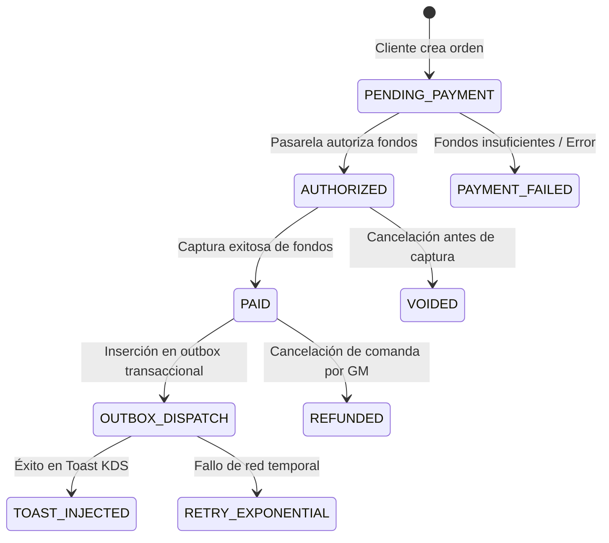

/**
 * @module NATIVE_API_CONTRACTS_PICKUP_DELIVERY_2026-10-09
 * @description Contratos autoritativos TypeScript para Menus V3, cotizaciones Toast (/prices),
 * inyección de órdenes (/orders), Delivery (DoorDash Drive), Webhooks y Outbox transaccional.
 * @businessRules
 * 1. La autoridad financiera reside en el servidor; el cliente nunca define precios finales vinculantes.
 * 2. Los modificadores deben validarse recursivamente contra el menú Toast para evitar omisiones de cobro.
 * 3. Las transacciones a cocina sólo se despachan tras confirmación irrevocable de pago (PAID).
 */

# 📑 CONTRATOS NATIVOS DE INTEGRACIÓN: PICKUP Y DELIVERY
**Empresa:** Tacos Gavilan  
**Fecha:** 9 de octubre de 2026  
**Zona Horaria:** `America/Los_Angeles`  

---

## 1. Contratos de Menú Toast (Menus V3) y Validación de Modificadores

```typescript
export interface ToastMenuV3Option {
  guid: string
  name: string
  price: number
  isDefault?: boolean
}

export interface ToastMenuV3Group {
  guid: string
  name: string
  minSelections: number
  maxSelections: number
  required: boolean
  options: ToastMenuV3Option[]
}

export interface ToastMenuV3Item {
  guid: string
  name: string
  price: number
  calories?: number | null // Omitido o nulo si no está certificado
  modifierGroups: ToastMenuV3Group[]
}

/**
 * Valida que cada selección de modificador enviada por el cliente exista
 * dentro de las reglas del grupo de Toast y pertenezca al catálogo oficial.
 */
export function validateCartLineAgainstMenuV3(
  item: ToastMenuV3Item,
  selectedModifierGuids: string[]
): { valid: boolean; calculatedPrice: number; errors: string[] } {
  const errors: string[] = []
  let total = item.price
  const selectedSet = new Set(selectedModifierGuids)

  for (const group of item.modifierGroups) {
    const groupSelectedCount = group.options.filter(opt => selectedSet.has(opt.guid)).length
    if (group.required && groupSelectedCount < group.minSelections) {
      errors.push(`Grupo requerido '${group.name}' incompleto (mínimo ${group.minSelections})`)
    }
    if (groupSelectedCount > group.maxSelections) {
      errors.push(`Grupo '${group.name}' excede el límite máximo de ${group.maxSelections}`)
    }
    for (const opt of group.options) {
      if (selectedSet.has(opt.guid)) {
        total += opt.price
        selectedSet.delete(opt.guid)
      }
    }
  }

  if (selectedSet.size > 0) {
    errors.push(`Modificadores no reconocidos para este platillo: ${Array.from(selectedSet).join(', ')}`)
  }

  return { valid: errors.length === 0, calculatedPrice: Number(total.toFixed(2)), errors }
}
```

---

## 2. Contrato de Cotización Oficial Toast (`POST /orders/v2/prices`)

```typescript
export interface ToastPricesRequest {
  restaurantGuid: string
  diningOptionGuid: string
  checks: Array<{
    guid?: string
    selections: Array<{
      itemGuid: string
      quantity: number
      modifiers?: Array<{
        optionGuid: string
        quantity: number
      }>
    }>
  }>
}

export interface ToastPricesResponse {
  checks: Array<{
    amount: number
    taxAmount: number
    tipAmount?: number
    totalAmount: number
    selections: Array<{
      itemGuid: string
      price: number
      tax: number
    }>
  }>
}
```

---

## 3. Contrato de Creación de Orden Nativa (`POST /orders/v2/orders`)

```typescript
export interface ToastOrderCreatePayload {
  restaurantGuid: string
  diningOption: {
    guid: string
  }
  checks: Array<{
    guid: string
    selections: Array<{
      item: { guid: string }
      quantity: number
      price?: number
      modifiers?: Array<{
        item: { guid: string }
        quantity: number
      }>
    }>
    payments: Array<{
      type: 'OTHER' | 'CREDIT'
      amount: number
      tip?: number
      otherProviderName?: string // Ej. "Tacos Gavilan App (Stripe)"
    }>
  }>
  customer?: {
    firstName: string
    lastName?: string
    phone: string
    email?: string
  }
  fulfillmentInfo?: {
    curbside?: {
      vehicleDescription?: string
      stallNumber?: string
    }
    delivery?: {
      address: {
        street1: string
        street2?: string
        city: string
        state: string
        zip: string
      }
      notes?: string
    }
  }
}
```

---

## 4. Máquina de Estados Financieros y Outbox Pattern



### Definición del Registro Outbox en PostgreSQL:
```sql
CREATE TABLE public.app_orders_outbox (
  id UUID PRIMARY KEY DEFAULT gen_random_uuid(),
  order_id UUID NOT NULL REFERENCES public.app_orders(id) ON DELETE CASCADE,
  event_type VARCHAR(50) NOT NULL, -- 'INJECT_TOAST_ORDER', 'DISPATCH_DOORDASH'
  payload JSONB NOT NULL,
  status VARCHAR(30) NOT NULL DEFAULT 'PENDING', -- 'PENDING', 'PROCESSING', 'COMPLETED', 'FAILED'
  retry_count INT NOT NULL DEFAULT 0,
  max_retries INT NOT NULL DEFAULT 5,
  last_error TEXT,
  next_retry_at TIMESTAMPTZ NOT NULL DEFAULT NOW(),
  created_at TIMESTAMPTZ NOT NULL DEFAULT NOW(),
  processed_at TIMESTAMPTZ
);
```
