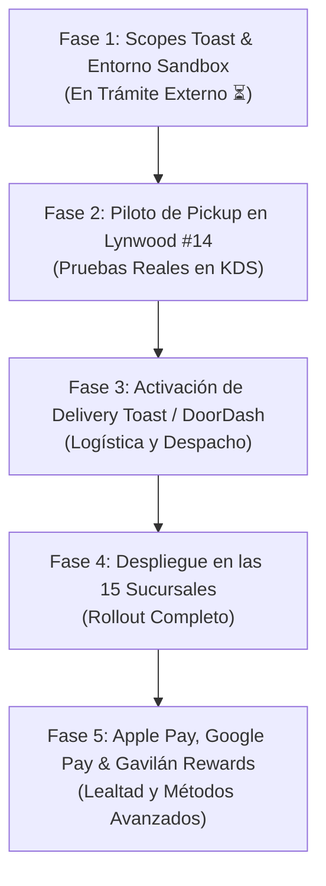

/**
 * @module ROADMAP_AND_BACKLOG_2026-10-09
 * @description Plan de ruta por fases y backlog priorizado para la app oficial Tacos Gavilan,
 * contemplando el desbloqueo de scopes en Toast, piloto Lynwood, delivery y expansión.
 * @businessRules
 * 1. Cada fase requiere verificación automatizada previa sin errores de TypeScript (npx tsc --noEmit).
 * 2. Cero pedidos ficticios o cobros sin autorización expresa de Carlos Velázquez.
 */

# 🗺️ ROADMAP Y BACKLOG PRIORIZADO (FASES 1 — 5)
**Empresa:** Tacos Gavilan  
**Fecha:** 9 de octubre de 2026  
**Zona Horaria:** `America/Los_Angeles`  

---

## 1. Cronograma Estratégico por Fases

---

## 2. Detalle de Fases y Criterios de Aceptación

### Fase 1: Habilitación de Scopes en Toast y Configuración de Sandbox (Actual)
* **Objetivo:** Obtener la aprobación formal de Toast Partner Connect para elevar las credenciales de Tacos Gavilan a categoría de Ordering Partner con scopes de escritura.
* **Actividades Clave:**
  - Enviar solicitud formal mediante la carta y plantilla en inglés de `docs/TOAST_PARTNER_CONNECT_OFFICIAL_REQUEST_2026.md`.
  - Habilitar scopes: `orders.prices:read`, `orders.orders:write`, `menus.menu:read`, `dining-options:read`.
  - Solicitar restaurante de pruebas (Toast Sandbox) para Lynwood #14.
* **Criterio de Éxito:** Invocación exitosa de `POST https://ws-api.toasttab.com/orders/v2/prices` retornando `HTTP 200 OK` con desglose impositivo y de línea.

### Fase 2: Piloto Controlado de Pickup en Lynwood (#14)
* **Objetivo:** Ejecutar las primeras comandas reales con Carlos Velázquez supervisando directamente en la cocina de Lynwood.
* **Actividades Clave:**
  - Configurar las variables de entorno live en `.env.local`.
  - Probar orden de mostrador (In-Store) y verificar que imprima o aparezca en el KDS de Lynwood.
  - Probar orden en auto (Curbside) verificando que el ticket indique el número de cajón y descripción del auto.
  - Comprobar que los precios en cocina y en la app coincidan con exactitud de centavo.
* **Criterio de Éxito:** 10 comandas consecutivas procesadas e inyectadas al KDS sin intervención manual ni discrepancias contables.

### Fase 3: Integración de Delivery (Toast Delivery Services / DoorDash Drive)
* **Objetivo:** Habilitar entrega a domicilio gobernada por contratos oficiales.
* **Actividades Clave:**
  - Confirmar con Toast si la entrega se canaliza vía Toast Delivery Services (TDS) o mediante la API directa de DoorDash Drive.
  - Activar el feature flag `ENABLE_MOBILE_DELIVERY = true` en el backend.
  - Validar límites geográficos con el radio estricto de 5.0 millas alrededor de cada sucursal.
  - Probar ciclo completo de despacho, tracking de repartidor y webhook de entrega completada con fotografía.
* **Criterio de Éxito:** Repartidor Dasher asignado y comanda entregada dentro de la ventana de tiempo prometida.

### Fase 4: Despliegue Masivo en las 15 Sucursales
* **Objetivo:** Expandir la operación móvil a toda la cadena de Tacos Gavilan.
* **Actividades Clave:**
  - Sincronizar los 15 menús y verificar los identificadores de dining options de cada una de las tiendas.
  - Capacitar a los gerentes y supervisores de área sobre la identificación de tickets móviles.
  - Auditar la recaudación impositiva CDTFA tienda por tienda para garantizar concordancia con las declaraciones fiscales.
* **Criterio de Éxito:** 15 sucursales operando en vivo con menú y precios sincronizados diariamente.

### Fase 5: Apple Pay, Google Pay y Programa Gavilán Rewards
* **Objetivo:** Maximizar la tasa de conversión y recurrencia de compra de los clientes.
* **Actividades Clave:**
  - Integrar el Apple Pay Merchant Certificate y Google Pay en la interfaz de pago de Expo.
  - Activar el motor de lealtad Gavilán Rewards: acumulación de 1 punto por cada $1.00 gastado y canje de 250 puntos por taco regular.
  - Notificaciones push de recompensas y ofertas personalizadas.
* **Criterio de Éxito:** Pagos biométricos con un solo toque (Face ID / Touch ID) con tiempo de checkout inferior a 5 segundos.
