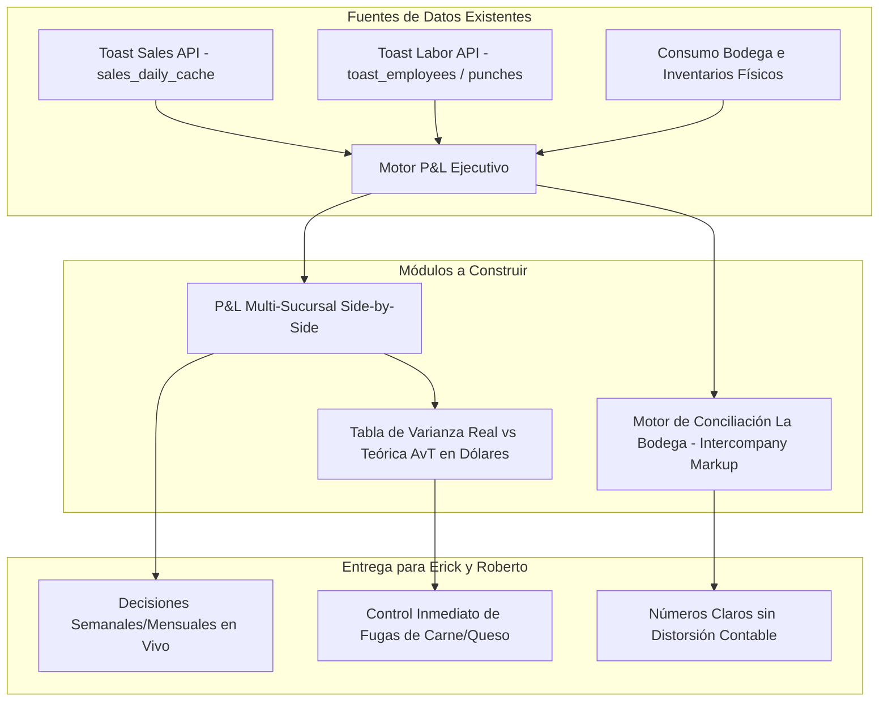

# 📋 DOCUMENTACIÓN INTEGRAL: REUNIÓN ESTRATÉGICA CON RESTAURANT365

**Empresa:** Tacos Gavilan  
**Fecha:** 08 de Septiembre de 2026 | 12:48 PM – 1:41 PM PDT (52m 53s)  
**Archivo Audiovisual:** `Restaurant365 Zoom Meeting 2026-09-08 12-48-22.mp4`  
**Participantes:**
- **Erick Velázquez** — Hijo de Roberto Velázquez (*Investigación Estratégica / Stakeholder*)
- **Carlos Velázquez** — General Manager Lynwood #14 / Arquitecto y Desarrollador de `teg-modernizado`
- **Zane Roegiers** — *Account Executive* (Ejecutivo de Ventas, Restaurant365)
- **Eddy Salas** — *Solutions Consultant* (Demostrador Técnico, Restaurant365)

---

## 🎯 1. LA NARRATIVA CENTRAL: POR QUÉ RESTAURANT365 SE FUE DECEPCIONADO

La intuición de Carlos es **100% certera y evidente en el audio y video**. El equipo de ventas de Restaurant365 llegó a la llamada con su guion clásico para cadenas medianas (15 tiendas), asumiendo que encontrarían un negocio operando con métodos arcaicos:
1. Recetas en carpetas de papel o Excels desconectados.
2. Gerentes haciendo pedidos en papelitos o mensajes de texto.
3. Desconexión total entre las ventas de Toast POS y el consumo de carne.
4. Cero visibilidad de inventarios teóricos.

### El Desinfle Gradual del Guion de Ventas de Zane Roegiers:
- **Paso 1: El anzuelo de los \$1.15 Millones de dólares.** Zane abrió la llamada con la promesa de que R365 les *"devolvería \$1.15 millones de dólares al año"* recortando un 2% del costo de comida (*Food Cost*).
- **Paso 2: El choque con la realidad de La Bodega.** Zane intentó hablar de proveedores gigantes (Sysco, US Foods). Erick le aclaró que Tacos Gavilan opera su propio centro de producción y distribución (**La Bodega** / Comisariato), que procesa carnes, salsas y empaca en bolsas propias, distribuyendo con camiones propios a las 15 tiendas mediante un sistema de pedidos mínimos (*Par Levels*) ya programado en su app propia.
- **Paso 3: El golpe demoledor de las Recetas.** Al minuto 20, Zane intentó hacer la pregunta clásica que deja en evidencia a los restaurantes:  
  *“¿Dónde viven sus recetas hoy? ¿En un Excel? ¿En un libro?”*  
  Erick y Carlos le respondieron que **viven dentro de su propia app, sincronizadas con Toast POS y actualizándose cada 15 minutos**. Zane quedó descolocado: su gran producto estrella (la explosión de recetas teóricas desde Toast) ya estaba programado y funcionando en Tacos Gavilan.
- **Paso 4: El reporte de Actual vs. Teórico.** Al minuto 45, Eddy mostró su reporte más avanzado: el comparativo de libras teóricas vs. reales de queso Monterrey Jack. Cuando Eddy le preguntó a Carlos cómo lo hacían ellos, Carlos explicó su desarrollo y Eddy tuvo que traducirle a Zane:  
  *“Yeah Zane, he says it’s pretty close to what you’re showing… it sounds pretty similar according to Carlos.”*
- **Paso 5: La retirada comercial.** Al darse cuenta de que no podían venderles inventario, ni recetas, ni pedidos a bodega, ni conexión a Toast, Zane tuvo que retroceder drásticamente. Su único salvavidas al final de la llamada fue:  
  *“Bueno… tal vez podamos ayudar a tu tía y a su asistente con QuickBooks para que no capturen a mano…”*

---

## 📜 2. CRÓNICA DIALÓGICA Y MINUTA DETALLADA DE LA REUNIÓN

### Bloque 1 (00:00 – 05:00) | La Estructura de Compras y el Comisariato
- **Eddy Salas (R365):** Inicia la llamada en español preguntando si compran con grandes distribuidores como Sysco, PFG o US Foods.
- **Erick Velázquez:** Aclara que no trabajan con proveedores masivos; tienen una combinación de proveedores locales más pequeños.
- **Eddy:** Pregunta cuál es el proceso actual para recibir facturas y actualizar el costo de los ingredientes.
- **Erick:** Explica que las facturas entran a través de QuickBooks donde contabilidad las procesa. Pero introduce el factor clave del negocio:  
  *“Hacemos algo particular porque nuestros restaurantes no compran directo a los proveedores ya que tenemos un comisariato (La Bodega). Compramos con el comisariato y los restaurantes le compran a nuestro comisariato. Hay números extraños ahí, y por eso con los Estados de Resultados (P&L) no hemos podido hacerlos con precisión.”*
- **Eddy:** Pregunta cómo piden los restaurantes a La Bodega.
- **Erick:** Explica que en su aplicación interna (*in-house app*) establecieron un sistema de niveles mínimos (*Par System*). Los gerentes revisan su inventario físico, mandan la lista por la app, y el comprador de La Bodega asigna y surte lo necesario.

### Bloque 2 (05:00 – 10:00) | Procesamiento en Bodega y Facturación
- **Zane Roegiers (R365):** Pregunta si la comida se procesa en La Bodega.
- **Erick:** Confirma que La Bodega procesa todo: la carne se marina con especias, se corta y se empaca en bolsas y cajas propias. Se manda cruda a las tiendas para asarse al momento en la parrilla.
- **Eddy:** Pregunta si las tiendas hacen inventarios mensuales para calcular el porcentaje de costo de comida (*COGS percentage*).
- **Erick:** Responde que en la aplicación propia tienen inventarios diarios conectados a Toast POS:  
  *“Cuando se hace una orden en Toast, esa información se envía a nuestra app y la receta muestra cuánto se utilizó, permitiéndonos comparar lo que se usó vs. lo que debió usarse.”*
- **Eddy:** Pregunta sobre el recargo (*markup*) de La Bodega a las tiendas. Erick explica que contabilidad maneja esa parte de cobro interno y que por eso busca ordenar esos números.

### Bloque 3 (10:00 – 15:00) | La Promesa de los \$1.15 Millones
- **Eddy:** Explica que en R365, cuando entra una factura de proveedor a La Bodega, automáticamente se actualiza el inventario en existencia (*On Hand*), el costo del ingrediente crudo, y escala en cascada el costo de todas las recetas preparadas que se transfieren a las tiendas.
- **Zane:** Interviene para intentar justificar el costo de Restaurant365:  
  *“Mencionaste que han hecho obsoletos otros softwares como cámaras… Si son capaces de ahorrar en esas piezas, pueden usar una herramienta que cuesta dinero como R365 para beneficiar al negocio y recuperar esos \$1.15 millones de dólares. Me encantaría saber qué prioridad tienen Carlos y tú en el desarrollo.”*
- **Erick:** Da una respuesta muy centrada y prudente:  
  *“Siempre estamos buscando mejorar nuestra app. Siendo realistas, nos gustaría llevarla al nivel de lo que hace 365 porque intentamos lograr lo mismo. No estoy seguro si podemos mostrarles nuestra aplicación hoy, pero queríamos ver cómo funciona la suya.”*

### Bloque 4 (15:00 – 20:00) | App Móvil y Conexión con Toast POS
- **Erick:** Pregunta si la aplicación móvil de R365 tiene todas las funciones o si es una versión recortada (*light version*).
- **Eddy:** Explica que la app móvil es idéntica y muy completa, usada por clientes como Luna Grill (54 sucursales sin computadoras portátiles, operando 100% en iPads y celulares).
- **Demostración de Pantalla (*frame_026.jpg*):**  
  Eddy muestra el módulo de boletos de venta (*Sales Tickets*) jalados de Toast:
  - Sucursal de prueba: *Asada Taco Company Irvine*.
  - Muestra columnas: Número de cheque, fecha, hora del pedido, mesero, tipo de servicio (*Dine In*, *DoorDash*), ventas netas, impuestos, propinas y total.
  - Explica que a partir de cada platillo vendido, el sistema calcula el consumo teórico (*Theoretical Depletion*) multiplicando los ingredientes de la receta.

### Bloque 5 (20:00 – 25:00) | El Momento Clave: La Sorpresa de Zane
- **Eddy:** Da el ejemplo: si se venden 3 tazones de pollo (*burrito bowls*), el sistema sabe exactamente cuántas onzas de pollo, arroz, frijoles y queso debieron gastarse.
- **Zane (intentando tender la trampa comercial):**  
  *“Today Eric, where do your recipes live? Are they in an Excel sheet? In a book?”*
- **Erick:**  
  *“We have our recipes within our app… With the integration, the recipes show, and we compare what was used, what was supposed to be used, and what shows that we used.”*
- **Zane (sorprendido):**  
  *“Within the app? Does it cost out the recipes in live time?”*
- **Erick (volteando con Carlos):**  
  *“Carlos, ¿cada 15 minutos se hace un update para las recetas?”* (Carlos confirma).
- **Erick:**  
  *“Sí, está sincronizado y obtenemos la información rápido. Mi interés principal es poder generar un Estado de Resultados (P&L) real. Eso fue lo que realmente despertó mi interés: ver cómo combinar todo eso.”*
- **Zane (intentando rescatar su argumento):** Pregunta si conocen su porcentaje de costo de comida por tienda. Erick responde que sí lo tienen por tienda y por artículo, aunque quieren afinarlo más.

### Bloque 6 (25:00 – 30:00) | Daily Sales Summary (DSS) y Mano de Obra
- **Demostración (*frame_036.jpg*):**  
  Eddy muestra el proceso de cierre diario del gerente (*Daily Sales Summary*):
  - **Mano de Obra (*Labor*):** Empleados, horas trabajadas vs. horas programadas en el horario (*Scheduled vs. Worked Variance*), descansos (*Breaks*), horas extras diarias y semanales (*OT Day/Week*).
  - **Depósitos (*Deposits*):** Cuadre de efectivo reportado vs. sobre/faltante en caja (*Over/Short*).
  - **Transacciones (*Transactions*):** Validación de pagos y propinas.
- Eddy recalca que con Toast POS jalando ventas y mano de obra automáticamente, dos tercios del costo primo (*Prime Cost*) de un restaurante ya entran solos al sistema todos los días.

### Bloque 7 (30:00 – 35:00) | Estados de Resultados Multi-Tienda (P&L Side-by-Side)
- **Demostración (*frame_041.jpg*, *frame_047.jpg*, *frame_053.jpg*):**  
  Eddy abre el reporte estrella de R365: *Profit & Loss - Location Side by Side*.
  - Columnas paralelas: *Asada Taco Company Irvine* | *San Clemente* | *San Diego* | *Total Consolidado*.
  - Filas mostradas:
    1. **Ventas (*Sales*):** Brutas, cortesías/descuentos (*Comps & Discounts*), netas.
    2. **Costo Primo (*Prime Cost*):** Costo de comida (*COGS* ~31%), salarios (*Wages* ~25-28%), beneficios (~5%).
    3. **Utilidad Bruta (*Gross Profit*):** ~35-38%.
    4. **Gastos de Operación (*Operating Expenses*):** Renta, suministros, mantenimiento (*R&M*), mercadeo.
    5. **Utilidad Operativa (*Operating Profit*).**
    6. **Gastos Corporativos Centrales (*Corporate Overhead*).**
    7. **EBITDA y Utilidad Neta (*Net Profit*).**

### Bloque 8 (35:00 – 40:00) | Trazabilidad a Facturas y Gastos en Meta Ads
- **Erick:** Pregunta cómo se profundiza en una cifra extraña del P&L:  
  *“Si vemos un gasto como Mercadeo (Marketing), ¿podemos ver de dónde viene? Por ejemplo, si pagamos anuncios en Meta (Facebook/Instagram), ¿se ingresan a mano o se pueden automatizar?”*
- **Eddy:** Muestra que al hacer clic en cualquier cifra azul, el sistema abre la factura o póliza contable de origen (*Click-to-Source Drilldown*). Sobre Meta Ads, admite que alguien debe capturarlo inicialmente a mano, pero R365 permite crear reglas recurrentes para **prorratear (*spread expenses*)** automáticamente (ej. \$1,000 divididos en \$100 mensuales entre 10 tiendas).
- **Zane:** Insiste en que la rapidez de los reportes ayuda a tomar decisiones rápidas, mencionando que otro cliente (Maru Hospitality) ahorró \$400,000 en costo de comida en 4 tiendas.

### Bloque 9 (40:00 – 45:00) | La Visión de Negocio de Erick Velázquez
- **Zane:** Pregunta a Erick cómo aprovecharía tener un P&L semanal de las 15 tiendas para sus visitas a sucursales.
- **Erick:** Explica su filosofía directiva:  
  *“En realidad no tengo un plan fijo todavía porque no puedo tomar decisiones sin información. Necesito ver la información para fundamentar una decisión: entender por qué un restaurante gasta más que otro si vende menos. Queremos ver números reales y proporciones (*ratios*). Actualmente los P&L nos llegan trimestrales o a fin de año, y ni siquiera sé qué tan exactos son con todos los gastos que ocurren. Si podemos consolidar todo en una sola hoja, sería genial.”*

### Bloque 10 (45:00 – 50:00) | Actual vs. Teórico (El Segundo Golpe de Carlos)
- **Demostración (*frame_061.jpg*, *frame_066.jpg*):**  
  Eddy muestra la pantalla de *Actual vs. Theoretical Analysis* (AvT) por ingrediente:
  - Ejemplo con Queso Monterrey Jack: Consumo Teórico según recetas vendidas en Toast = 76.24 lbs (\$205.85). Consumo Real según inventario físico = 93.46 lbs (\$252.35). **Varianza no explicada = 17.22 lbs perdidas (\$46.50 de merma en una semana)**.
- **Eddy le pregunta a Carlos:**  
  *“Carlos, ¿cómo calculan ustedes el costo de la materia prima en su aplicación?”*
- **Carlos:** Explica por audio el funcionamiento del módulo propio de Tacos Gavilan.
- **Eddy (asombrado, traduciendo a Zane):**  
  *“Yeah Zane, he says it’s pretty close to what you’re showing… it sounds pretty similar according to Carlos.”*
- **Zane:** Con tono derrotado, pregunta cómo usan esa información hoy en día. Erick responde que cuando una tienda sale disparada en consumo, van e investigan si se cayó una bolsa de carne, si hubo reembolsos o qué ocurrió.

### Bloque 11 (50:00 – 52:54) | La Retirada de R365
- Zane se da cuenta de que el software que Carlos programó ya hace lo que ellos cobran miles de dólares por hacer.
- Su último intento comercial es ofrecer una reunión con la tía contadora de Erick para ver si pueden reemplazar o complementar QuickBooks.
- Erick acepta intercambiar disponibilidad por correo y la reunión concluye cordialmente.

---

## 📊 3. MATRIZ DE COMPARACIÓN: RESTAURANT365 VS. TEG-MODERNIZADO

| Capacidad Operativa / Financiera | Restaurant365 (\$4,500 - \$7,500/mes) | teg-modernizado (Construido por Carlos) | Diagnóstico Estratégico |
| :--- | :---: | :---: | :--- |
| **Integración Toast POS** | ✅ API estándar con boletos a nivel de cheque | ✅ API nativa directa con mapeo de Dining Options al centavo | **Empate Total** (Misma calidad y precisión) |
| **Explosión de Recetas (PMIX)** | ✅ Mapeo de menú a ingredientes | ✅ Soporte de modificadores, party trays dinámicos y combos | **Empate Total** |
| **Frecuencia de Actualización** | ⏱️ Procesamiento nocturno o por lotes | ⚡ **Sincronización en vivo cada 15 minutos** | **Ventaja Tacos Gavilan** |
| **Ritmo de Parrilla (*Cooking Pace*)** | ❌ **No existe** (solo da datos pasados) | 🚀 **Proyección cruda a parrilla cada 30 min con acelerador intradía** | **Victoria Total Tacos Gavilan** (R365 es incapaz de hacer esto) |
| **Pedidos a Comisariato (La Bodega)** | ✅ Módulo de pedidos genérico | ✅ Sistema de Par Levels personalizado a la operación | **Empate Total** |
| **Análisis Actual vs. Teórico (AvT)** | ✅ Tabla visual en libras y dólares | ✅ Datos calculados en DB; falta tabla visual ejecutiva | **Paridad Técnica** (Solo falta diseñar la vista) |
| **P&L Multi-Tienda Lado a Lado** | ✅ Tabla interactiva con EBITDA | ❌ Depende de QuickBooks manual anual | **Brecha #1 a construir en teg** |
| **Trazabilidad (*Drilldown a Facturas*)**| ✅ Clic abre documento escaneado | ❌ Aislado en contabilidad tradicional | **Brecha #2 a construir en teg** |
| **Facturación Bodega vs Tiendas** | ✅ Conciliación Intercompany | ⚠️ Cálculos manuales en contabilidad | **Brecha #3 a resolver en teg** |
| **Costo para la Empresa** | 💸 **\$50,000 - \$90,000 USD al año** + \$20k setup | 🟢 **\$0 USD adicionales** (Propiedad 100% de Tacos Gavilan) | **Ahorro brutal para Roberto Velázquez** |

---

## 🛠️ 4. PLAN MAESTRO PARA CARLOS: CÓMO CUBRIR LAS 3 BRECHAS FALTANTES

Para presentarle una solución contundente a Roberto y Erick Velázquez y demostrarles por qué **NO** se debe contratar a Restaurant365, implementaremos en `teg-modernizado` las 3 piezas exactas que Erick pidió:

### 1. El Módulo de P&L Multi-Sucursal (`/admin/finanzas/pnl`)
- **Estructura idéntica a la mostrada en R365:**
  - 15 columnas con cada sucursal de Tacos Gavilan + 1 columna de Total Consolidado.
  - **Ventas Netas** (automáticas desde Toast).
  - **Costo Primo (*Prime Cost*):**
    - Costo de Comida Real (desde inventarios y compras de Bodega).
    - Costo Laboral Real (desde los ponches y salarios de Toast).
  - **Gastos Operativos (*OpEx*):**
    - Campos fijos configurables por tienda para Renta, Mantenimiento (*R&M*), Luz, Gas, Basura, Seguros.
    - Prorrateo de Mercadeo (ej. Meta Ads dividido equitativamente entre las 15 tiendas).
  - **Utilidad Operativa y Utilidad Neta.**
- **Frecuencia:** Generación semanal o mensual instantánea con un clic.

### 2. El Motor de Facturación y Eliminación de La Bodega (*Intercompany Engine*)
- Resolver de raíz la queja de Erick sobre los "números extraños":
  - Cuando La Bodega surte carne marinada a Lynwood #14 con un margen del 10% para cubrir costos de operación:
    - En el **P&L de Lynwood**, la carne aparece al precio de transferencia (\$3.30/lb) para medir con justicia la rentabilidad de la tienda.
    - En el **P&L Consolidado de la Empresa**, el sistema elimina automáticamente ese margen interno y registra el costo de origen pagado al proveedor (\$3.00/lb).
  - Esto elimina la doble contabilización y le da a Roberto Velázquez la utilidad corporativa exacta al centavo.

### 3. La Tabla Ejecutiva de Varianza Real vs. Teórica en Dólares (`/admin/inventario/varianza`)
- Replicar la pantalla exacta del queso Monterrey Jack (`frame_061.jpg`):
  - Columnas: *Ingrediente | Unidad | Costo Unitario | Consumo Teórico (Toast) | Consumo Real (Inventario) | Varianza en Libras | Impacto Financiero (\$) | Eficiencia %*.
  - Filtro por sucursal y rango de fechas.
  - Ordenar por impacto financiero para que los supervisores vean en el primer renglón qué producto les costó más dinero en pérdidas durante la semana.

---

## 🏆 5. MENSAJE SUGERIDO PARA ERICK Y ROBERTO VELÁZQUEZ

> *"Erick, estuve revisando a detalle todo lo que nos mostró el equipo de Restaurant365. Como pudiste ver en la llamada, cuando ellos quisieron sorprendernos con el control de recetas, la conexión a Toast POS y el inventario teórico, se toparon con que nuestro sistema ya lo tiene funcionando en tiempo real cada 15 minutos.*
>
> *Restaurant365 cobra entre \$4,500 y \$7,500 dólares al mes por 15 restaurantes más la bodega (más de \$60,000 USD al año), más cobros de instalación. Lo único que nos falta no es la parte operativa —la cual nuestro sistema maneja mucho mejor e incluso incluye el ritmo de parrilla en vivo que ellos ni siquiera tienen—, sino la presentación visual del Estado de Resultados (P&L) consolidado y la conciliación de los márgenes de La Bodega.*
>
> *En lugar de pagarle una fortuna mensual a una empresa externa para volver a configurar lo que ya tenemos, podemos construir ese P&L comparativo y la tabla de varianza en dólares directamente en nuestra plataforma. Así tendrán ustedes los reportes semanales con números 100% exactos y adaptados a la realidad de Tacos Gavilan, ahorrándole a la empresa decenas de miles de dólares al año."*
