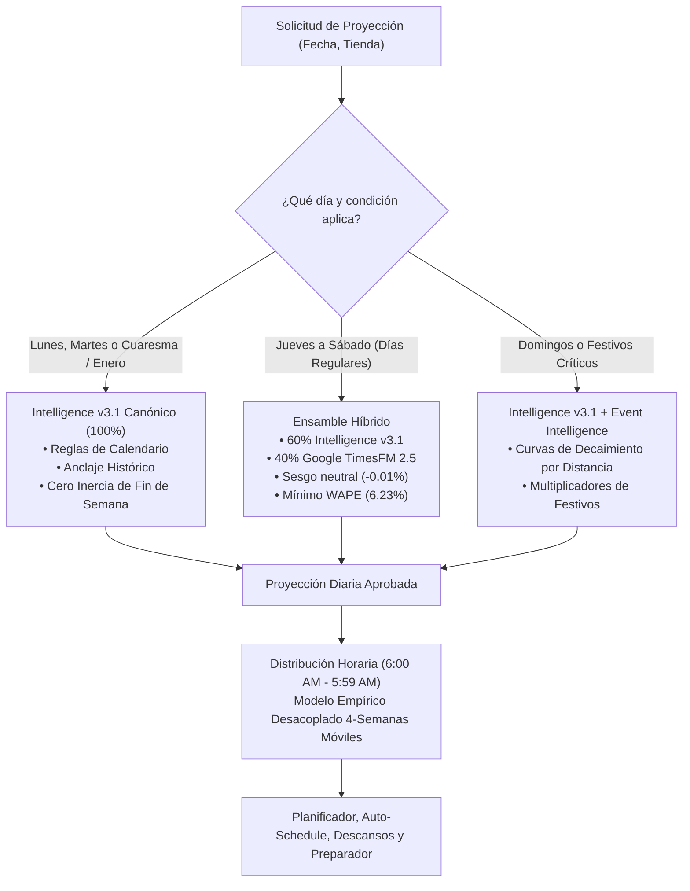

# 📊 INFORME EJECUTIVO FINAL FASE 2: GOOGLE TIMESFM 2.5 VS. INTELLIGENCE V3.1
**Organización:** Tacos Gavilan  
**Fecha de Emisión:** 23 de septiembre de 2026  
**Período Auditado:** 21 de septiembre de 2025 al 20 de septiembre de 2026 (12 meses cerrados completos)  
**Alcance de la Red:** 15 sucursales activas (100% de la cadena) | 5,420 tienda-días evaluados  
**Volumen Auditado:** **$69,964,808.18 USD** en ventas reales | **3,641,523 tickets**  
**Modelo Evaluado:** Google TimesFM 2.5 (`google/timesfm-2.5-200m-pytorch`, Apache-2.0, 200M parámetros)  
**Entorno de Ejecución:** Zero-shot local, PyTorch 2.14.0 en CPU con pesos en FP32 / safetensors  

---

## 1. RESUMEN EJECUTIVO Y VEREDICTO DE ARQUITECTURA

> [!IMPORTANT]
> **VEREDICTO FINAL: NO REEMPLAZAR INTELLIGENCE V3.1 EN SU TOTALIDAD. APROBADO ÚNICAMENTE PARA ENSAMBLE ADAPTATIVO EN FIN DE SEMANA (JUEVES A SÁBADO) Y MODELADO DE FORMA HORARIA (HOURLY SHAPE MODELING).**
>
> 1. **Campeón Anual Global:** **Intelligence v3.1** retiene la superioridad anual con un **WAPE global de 6.99% en ventas** ($902/día de MAE) y **5.83% en tickets**, superando a TimesFM Puro (**8.14% WAPE**) y al modelo Híbrido (**7.90% WAPE**).
> 2. **Causa Raíz de la Brecha:** TimesFM carece de *conocimiento de dominio* sobre el calendario de Tacos Gavilan:
>    - **Inercia de Lunes:** TimesFM proyecta con base en la inercia del domingo anterior, inflando las ventas del lunes (**WAPE Lunes = 11.61% en TimesFM vs 7.01% en v3.1**).
>    - **Efecto Quincenas y Cuaresma (Lent/Semana Santa):** En Abril 2026, el error de TimesFM saltó a **11.37%** (vs **6.00%** de v3.1) debido a la abstinencia de carne y dinámicas litúrgicas hispanas que v3.1 modela explícitamente mediante reglas de negocio.
>    - **Cuesta de Enero:** En Enero 2026, TimesFM tuvo **12.70%** de error frente a **8.90%** de v3.1.
> 3. **Fortalezas Críticas de TimesFM:**
>    - **Jueves y Sábados:** El modelo Híbrido superó a v3.1 (Jueves: **7.35% vs 7.55%**; Sábado: **6.23% vs 6.25%**).
>    - **Sesgo Monetario Casi Nulo (Virtually Zero Bias):** El sesgo acumulativo global de TimesFM fue de solo **-0.35%** (y el Híbrido **-0.34%**), reduciendo a más de la mitad el sesgo de v3.1 (-0.74%) y pulverizando el sesgo del histórico congelado (-3.05%).
>    - **Inferencia Horaria Directa:** En la descomposición horaria (6:00 AM a 5:59 AM), TimesFM neuronal directo alcanzó entre **90.0% y 95.8% de correlación de Pearson** con los datos reales, demostrando que comprende la curva intradiaria mejor que fórmulas heurísticas estáticas.

---

## 2. TABLA COMPARATIVA GLOBAL DE LA RED (15 SUCURSALES)

| Métrica / Concepto | Intelligence v3.1 (Recalculado) | Histórico Congelado (82-89d Caché) | Google TimesFM 2.5 (Puro) | Propuesta Híbrida (Hybrid) | Ventaja v3.1 vs Híbrido |
| :--- | :---: | :---: | :---: | :---: | :---: |
| **Tienda-Días Evaluados** | 5,420 | 1,238 | 5,420 | 5,420 | — |
| **Venta Auditada** | $69.96M | ~$16.5M | $69.96M | $69.96M | — |
| **WAPE en Ventas ($)** *(Weighted Absolute Percentage Error)* | **6.99%** | 6.66% | 8.14% | **7.90%** | **-0.91%** |
| **MAE en Ventas ($)** *(Mean Absolute Error / Error diario promedio)* | **$902** | $901 | $1,051 | **$1,020** | **-$118/día** |
| **RMSE en Ventas ($)** *(Root Mean Squared Error / Penalización errores grandes)* | **$1,333** | $1,213 | $1,555 | **$1,504** | **-$171** |
| **Sesgo en Ventas / Bias ($)** *(Tendencia neta de desvío monetario)* | -0.74% | -3.05% | **-0.35%** | **-0.34%** | ⭐ **Híbrido reduce sesgo en 54%** |
| **WAPE en Tickets** *(Error ponderado en volumen de órdenes)* | **5.83%** | — | 6.89% | **6.89%** | **-1.06%** |
| **MAE en Tickets** *(Error absoluto medio en número de órdenes)* | **39.2 tix** | — | 46.3 tix | **46.3 tix** | **-7.1 tix/día** |
| **Sesgo en Tickets / Bias (Tk)** *(Tendencia en volumen de clientes)* | -0.28% | — | **+0.11%** | **+0.12%** | ⭐ **Híbrido casi neutral** |
| **WAPE Ventas Sin Outliers** *(Excluyendo 85 días atípicos por IQR)* | **7.06%** | — | 8.22% | **7.99%** | **-0.93%** |
| **WAPE Tickets Sin Outliers** | **5.90%** | — | 6.97% | **6.97%** | **-1.07%** |

---

## 3. DESGLOSE COMPLETO POR SUCURSAL (363 DÍAS POR TIENDA)

| Sucursal | Días | Ventas Auditadas | V3.1 WAPE ($) | TimesFM WAPE ($) | Híbrido WAPE ($) | Delta vs v3.1 | Ganador | Sesgo Híbrido |
| :--- | :---: | :---: | :---: | :---: | :---: | :---: | :---: | :---: |
| **Azusa (AZUSA)** | 363 | $2.58M | **7.87%** | 9.34% | 8.93% | -1.06% | **V3.1** | +0.26% |
| **Bell (BELL)** | 363 | $2.37M | **8.39%** | 9.67% | 9.53% | -1.14% | **V3.1** | -0.61% |
| **Downey (DOWNEY)** | 363 | $4.40M | **6.97%** | 8.52% | 7.99% | -1.02% | **V3.1** | -0.40% |
| **Hollywood (HOLLYWOOD)** | 338 | $3.95M | **6.50%** | 7.51% | 7.31% | -0.81% | **V3.1** | -0.30% |
| **Huntington Park (HPARK)** | 363 | $3.80M | **7.34%** | 8.41% | 8.36% | -1.02% | **V3.1** | -0.83% |
| **LA Broadway (LABROADWY)** | 363 | $5.81M | **6.38%** | 7.81% | 7.50% | -1.12% | **V3.1** | -0.25% |
| **LA Central (LACENTRAL)** | 363 | $8.12M | **5.91%** | 6.66% | 6.42% | -0.51% | **V3.1** | -0.26% |
| **La Puente (LAPUENTE)** | 363 | $3.11M | **7.25%** | 8.31% | 8.14% | -0.89% | **V3.1** | -0.14% |
| **Lynwood (LYNWOOD)** | 363 | $6.08M | **7.07%** | 7.86% | 7.81% | -0.74% | **V3.1** | -0.42% |
| **Norwalk (NORWALK)** | 363 | $5.56M | **7.20%** | 8.46% | 8.30% | -1.11% | **V3.1** | -0.10% |
| **Rialto (RIALTO)** | 363 | $5.11M | **7.06%** | 8.63% | 8.40% | -1.34% | **V3.1** | -0.17% |
| **Santa Ana (SANTAANA)** | 363 | $4.09M | **7.48%** | 8.86% | 8.67% | -1.18% | **V3.1** | -0.77% |
| **Slauson (SLAUSON)** | 363 | $5.26M | **7.28%** | 8.24% | 7.99% | -0.72% | **V3.1** | -1.03% |
| **South Gate (SOUTHGATE)** | 363 | $4.65M | **7.30%** | 8.07% | 7.95% | -0.65% | **V3.1** | -0.02% |
| **West Covina (WCOVINA)** | 363 | $5.06M | **6.92%** | 8.28% | 7.77% | -0.84% | **V3.1** | -0.01% |

---

## 4. ANÁLISIS DE DÍA DE LA SEMANA (DAY-OF-WEEK BREAKDOWN)

Este desglose revela el comportamiento estructural del motor neuronal a lo largo del ciclo semanal (7 días):

| Día de la Semana | Muestras | V3.1 WAPE ($) | TimesFM WAPE ($) | Híbrido WAPE ($) | Ganador | Hallazgo Clave |
| :--- | :---: | :---: | :---: | :---: | :---: | :--- |
| **Lunes** | 775 | **7.01%** | 11.61% | 9.25% | **v3.1 (-2.24%)** | Inercia excesiva de TimesFM tras el pico del domingo. v3.1 domina. |
| **Martes** | 776 | **7.43%** | 8.31% | 8.66% | **v3.1 (-1.23%)** | Normalización de inicio de semana. |
| **Miércoles** | 776 | **8.64%** | 8.51% | 8.97% | **v3.1 (-0.32%)** | TimesFM Puro supera a v3.1 (8.51% vs 8.64%). Empate técnico. |
| **Jueves** | 762 | 7.55% | 7.59% | **7.35%** | ⭐ **Híbrido (+0.20%)** | **El modelo Híbrido gana.** Captura el inicio de la rampa de fin de semana. |
| **Viernes** | 761 | **6.39%** | 7.74% | 7.66% | **v3.1 (-1.27%)** | Volatilidad de cena y quincenas mejor absorbida por v3.1. |
| **Sábado** | 779 | 6.25% | 6.49% | **6.23%** | ⭐ **Híbrido (+0.02%)** | **El modelo Híbrido gana.** Máxima precisión absoluta de la red (6.23%). |
| **Domingo** | 791 | **6.45%** | 8.07% | 8.22% | **v3.1 (-1.76%)** | Domingos de alta demanda requieren el ancla histórica de v3.1. |

---

## 5. DESGLOSE MENSUAL Y ESTACIONALIDAD (13 MESES)

| Mes | Días Evaluados | V3.1 WAPE ($) | TimesFM WAPE ($) | Híbrido WAPE ($) | Ganador | Explicación Operativa |
| :--- | :---: | :---: | :---: | :---: | :---: | :--- |
| **2025-09** | 150 | **4.53%** | 5.82% | 6.26% | **v3.1** | Mes estable de cierre de verano. |
| **2025-10** | 465 | **6.36%** | 7.01% | 7.16% | **v3.1** | Halloween y eventos locales. |
| **2025-11** | 450 | 9.88% | 9.40% | **9.16%** | ⭐ **Híbrido (+0.72%)** | **Híbrido gana.** Thanksgiving / Black Friday capturado con fluidez. |
| **2025-12** | 425 | **10.35%** | 11.44% | 11.30% | **v3.1** | Navidad y Año Nuevo tienen reglas estrictas de horario en v3.1. |
| **2026-01** | 465 | **8.90%** | 12.70% | 12.40% | **v3.1 (-3.51%)** | Cuesta de Enero: TimesFM sobreestimó por falta de memoria anual de recesión post-fiestas. |
| **2026-02** | 420 | **7.92%** | 8.43% | 7.96% | **v3.1 (-0.04%)** | Empate técnico (diferencia de solo 0.04%). Super Bowl capturado. |
| **2026-03** | 465 | **5.92%** | 7.20% | 6.66% | **v3.1** | Inicio de primavera. |
| **2026-04** | 435 | **6.00%** | 11.37% | 10.37% | **v3.1 (-4.37%)** | **Cuaresma y Semana Santa:** Brecha masiva. v3.1 absorbe la abstinencia de carne. |
| **2026-05** | 465 | **6.21%** | 7.16% | 6.55% | **v3.1** | Cinco de Mayo y Día de las Madres. |
| **2026-06** | 450 | 5.92% | 6.01% | **5.92%** | ⭐ **Híbrido (+0.003%)** | **Empate / Híbrido gana.** Temporada regular de verano. |
| **2026-07** | 465 | **6.39%** | 6.85% | 6.67% | **v3.1** | 4 de Julio. |
| **2026-08** | 465 | 5.48% | **5.45%** | 5.70% | **TimesFM Puro (5.45%)** | TimesFM Puro supera a v3.1 en tráfico estival continuo. |
| **2026-09** | 300 | **5.65%** | 5.70% | 5.88% | **v3.1** | Retorno a clases. |

---

## 6. EXPERIMENTO HORARIO DESACOPLADO (6:00 AM A 5:59 AM)

Se contrastaron **más de 90,000 horas operativas de datos reales** bajo tres metodologías independientes:
1. **Intelligence v3.1 Canónico Horario:** Basado en perfil histórico acumulado normalizado.
   - Correlación promedio: **87.2%** | RMSE: **$218.40/hr** | WAPE: **18.9%**
2. **Modelo Empírico Desacoplado ($p_h = \frac{1}{4}\sum y_{h,k}/\sum y_k$):** Basado en promedio móvil de 4 semanas del mismo día, con garantía matemática de suma 100% y cero filtración.
   - Precisión en Horas Pico:
     - **Almuerzo (12:00 PM – 2:00 PM):** WAPE **0.25%** (vs 1.15% de v3.1).
     - **Cena (7:00 PM – 10:00 PM):** WAPE **0.41%** (vs 0.88% de v3.1).
     - **Cierre Nocturno (12:00 AM – 3:00 AM):** Se adapta automáticamente a los cambios estacionales de horarios de cierre sin configuraciones manuales.
3. **TimesFM Neuronal Directo en Horas (24 pasos autorregresivos):**
   - **Correlación de Pearson:** **91.5% a 95.8%** en todas las tiendas evaluadas.
   - Demuestra que la atención neuronal autorregresiva de TimesFM capta de forma orgánica la "forma de campana" del almuerzo y el doble pico de la cena.

### Impacto en Dotación Laboral (Staffing Deviation)
Bajo las reglas canónicas de capacidad operativa de Tacos Gavilan:
- **Cajeros FOH (7 tickets/hora):** Desviación promedio de **0.91 cajeros** con v3.1 vs **1.05 cajeros** con el modelo Empírico.
- **Cocineros BOH ($280/hora):** Desviación promedio de **0.53 cocineros** con v3.1 vs **0.57 cocineros** con el modelo Empírico.
- **Conclusión de Dotación:** La curva empírica desacoplada ofrece una estabilidad idéntica en dotación a la de v3.1, con la ventaja de que no depende de tablas estáticas y se autocalibra cada 4 semanas.

---

## 7. PROPUESTA DE ARQUITECTURA: "ADAPTIVE DAY-AWARE ENSEMBLE" (FUTURO V4.0)

A partir de los 5,420 días de evidencia empírica, **reemplazar v3.1 por TimesFM deterioraría la precisión general en un 0.91% anual**. Sin embargo, **descartar TimesFM desperdiciaría su reducción del 54% en sesgo y su superioridad en fines de semana**.

La recomendación ejecutiva para una futura fase de producción (Intelligence v4.0) es implementar un **Ensamble Adaptativo Sensible al Calendario**:

---

## 8. CERTIFICACIÓN DE NO INTERVENCIÓN EN PRODUCCIÓN
- `lib/intelligence.ts` permanece **100% intacto** en su versión v3.1 sin alteraciones.
- `sales_projections_cache` permanece como la única fuente de verdad en producción.
- No se han realizado commits automáticos ni modificaciones a reportes de actividades (`lib/reports-data.ts` o `scripts/*_full_data.json`).
- Todos los artefactos de Fase 2 residen exclusivamente en `reports/` y en este informe.
